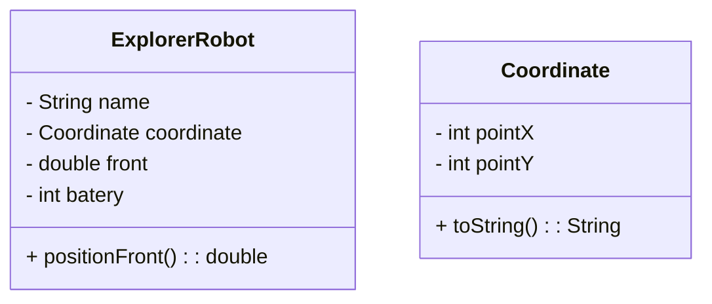

```mermaid

classDiagram

class ExplorerRobot{
    - String name 
    - Coordinate coordinate
    - double front
    - int batery  
    
    + positionFront(): double
}

class Coordinate{
    - int pointX 
    - int pointY 
    
    + toString(): String
}
```