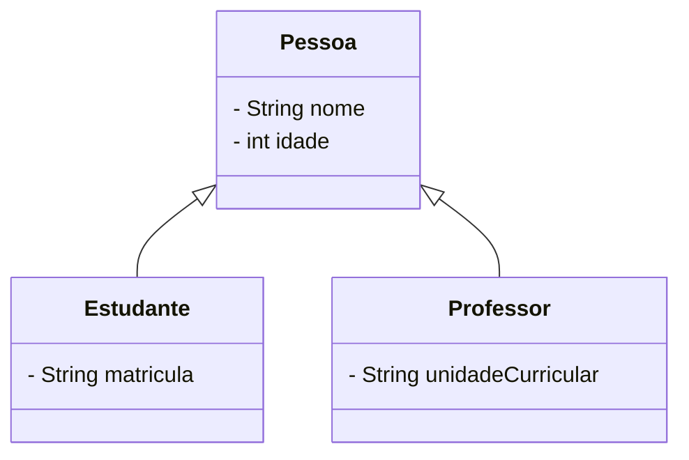
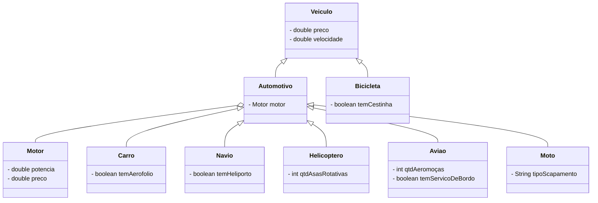
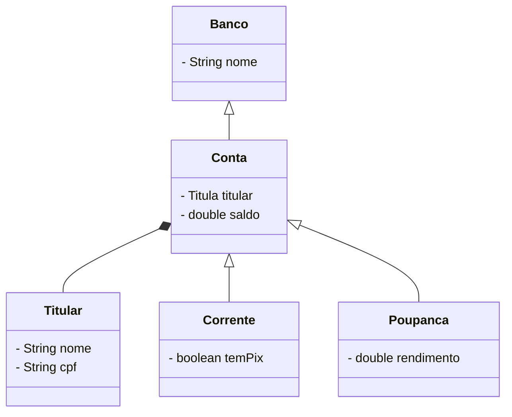

```mermaid
    classDiagram
        class Pessoa {
            - String nome
            - int idade
        }
        
        class Estudante {
            - String matricula
        }
        
        class Professor {
            - String unidadeCurricular
        }
        
        Pessoa <|-- Estudante  
        Pessoa <| -- Professor 
        
        
        

```

```mermaid
    classDiagram
        class Veiculo {
            - double preco
            - double velocidade
        }
        
        class Automotivo {
            - Motor motor
        }
        
        class Motor {
            - double potencia
            - double preco
        }
        
        class Carro {
            - boolean temAerofolio
        }
        
        class Bicicleta {
            - boolean temCestinha
        }
        
        class Moto {
            - String tipoScapamento
        }
        
        class Navio {
            - boolean temHeliporto
        }
        
        class Helicoptero {
            - int qtdAsasRotativas
        }
        
        class Aviao {
            - int qtdAeromoças
            - boolean temServicoDeBordo
        }
        
        Veiculo <|-- Bicicleta
        Veiculo <|-- Automotivo
        Automotivo o-- Motor
        Automotivo <|-- Carro
        Automotivo <|-- Navio
        Automotivo <|-- Helicoptero
        Automotivo <|-- Aviao
        Automotivo <|-- Moto
        
        
```

```mermaid
    classDiagram
        class Banco {
            - String nome
        }
        
        class Titular {
            - String nome
            - String cpf
        }
        
        class Conta {
            - Titula titular
            - double saldo
        }
        
        class Corrente {
            - boolean temPix
        }
        
        class Poupanca {
            - double rendimento
        }
        
        Banco <|-- Conta
        Conta *-- Titular
        Conta <|-- Corrente
        Conta <|-- Poupanca
```