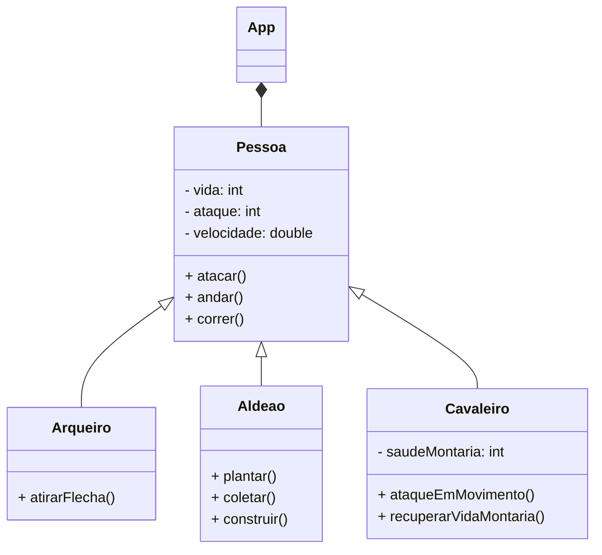

```mermaid
    classDiagram
        class App{
            
        }
        
        class Pessoa{
            - vida: int
            - ataque: int
            - velocidade: double
            
            + atacar()
            + andar()
            + correr()
        }
        
        class Arqueiro{
            + atirarFlecha()
            
        }
        
        class Aldeao{
            + plantar()
            + coletar()
            + construir()
        }
        
        class Cavaleiro{
            - saudeMontaria: int
            + ataqueEmMovimento()
            + recuperarVidaMontaria()
        }
        
        App *-- Pessoa
        Pessoa <|-- Arqueiro
        Pessoa <|-- Aldeao
        Pessoa <|-- Cavaleiro

```