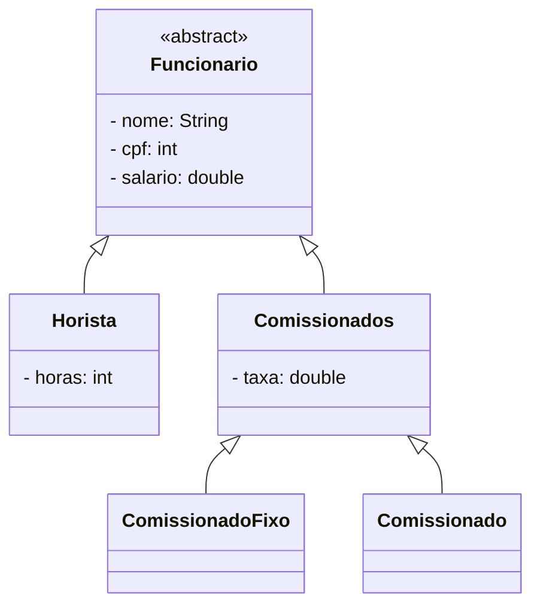

```mermaid
    classDiagram
        class Funcionario{
            <<abstract>>
            - nome: String
            - cpf: int
            - salario: double
        }
        
        c
       
        class Horista{
            - horas: int
        }
        class Comissionados{
            - taxa: double
        }
        class ComissionadoFixo{
            
        }
        class Comissionado{
            
        }
        
        Funcionario <|-- Horista
        Funcionario <|-- Comissionados
        Comissionados <|-- ComissionadoFixo
        Comissionados <|-- Comissionado
```