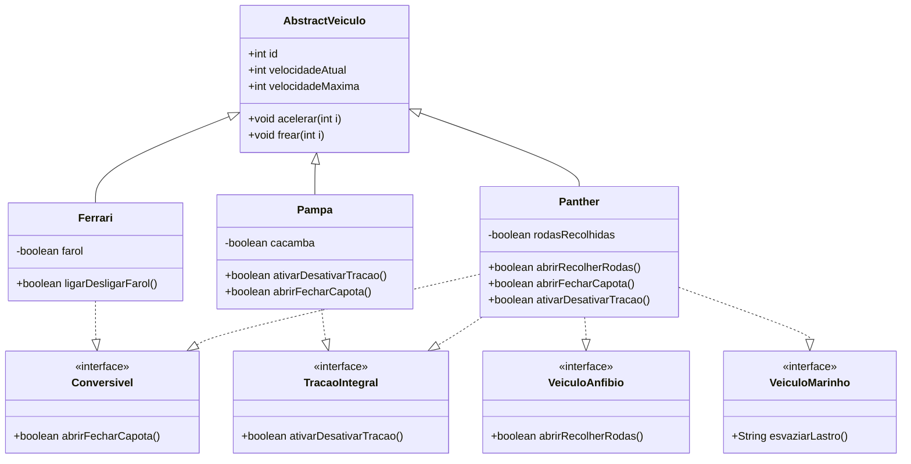

```mermaid
    classDiagram
    class AbstractVeiculo {
        +int id
        +int velocidadeAtual
        +int velocidadeMaxima
        +void acelerar(int i)
        +void frear(int i)
    }

    class Ferrari {
        -boolean farol
        +boolean ligarDesligarFarol()
    }

    class Pampa {
        -boolean cacamba
        +boolean ativarDesativarTracao()
        +boolean abrirFecharCapota()
    }

    class Panther {
        -boolean rodasRecolhidas
        +boolean abrirRecolherRodas()
        +boolean abrirFecharCapota()
        +boolean ativarDesativarTracao()
    }

    class Conversivel {
        <<interface>>
        +boolean abrirFecharCapota()
    }

    class TracaoIntegral {
        <<interface>>
        +boolean ativarDesativarTracao() 
        }

    class VeiculoAnfibio {
        <<interface>>
        +boolean abrirRecolherRodas()
    }

    class VeiculoMarinho {
        <<interface>>
        +String esvaziarLastro()
    }

AbstractVeiculo <|-- Ferrari
AbstractVeiculo <|-- Pampa
AbstractVeiculo <|-- Panther

Ferrari ..|> Conversivel
Pampa ..|> TracaoIntegral
Panther ..|> VeiculoAnfibio
Panther ..|> Conversivel
Panther ..|> VeiculoMarinho
Panther ..|> TracaoIntegral

```